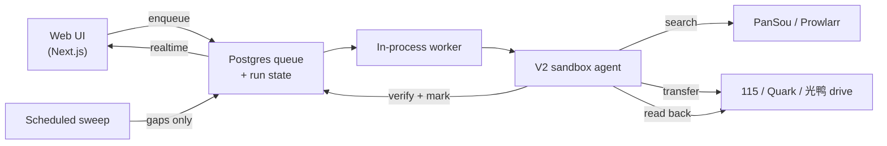

<p align="center">
  
</p>

<p align="center">
  <b>An agent-driven media library for your cloud drives.</b>
</p>

<p align="center">
  <a href="https://github.com/fancydirty/mediary-scout/actions/workflows/ci.yml"></a>
  <a href="LICENSE"></a>
  
  
  
  
  <a href="https://github.com/fancydirty/mediary-scout/pulls"></a>
  <a href="https://mediary.dirtyfancy.sbs"></a>
</p>

<p align="center">
  <a href="#quick-start">Quick start</a> ·
  <a href="docs/deploy.md">Deploy guide</a> ·
  <a href="https://mediary.dirtyfancy.sbs">Live demo ↗</a> ·
  <a href="README.zh-CN.md">中文文档</a>
</p>

You ask for a movie, show, or anime; an LLM agent scouts resources across your indexers, transfers the best match into your own 115 / Quark / 光鸭 drive, verifies what landed, and keeps tracking what's still missing.


> *Above: the read-only [live demo](https://mediary.dirtyfancy.sbs) — search → 获取 → the agent works through search, transfer, and verification.*

> **Disclaimer.** Mediary Scout is **open-source, self-hosted software**. It is **not** offered, and never will be offered, as a hosted service — you run your own instance and bring your own drive / LLM / metadata credentials. It performs the same kinds of file operations you could do by hand in your own cloud drive. See [docs/distribution-and-legal-positioning.md](docs/distribution-and-legal-positioning.md) for the project's stance.

## Contents

- [What it is](#what-it-is)
- [Features](#features)
- [Architecture](#architecture)
- [Quick start](#quick-start)
- [macOS desktop app](#macos-desktop-app)
- [Agent API](#agent-api-agent-first-control)
- [Deploy](#deploy)
- [Demo](#demo)
- [Supported drives](#supported-drives)
- [Status & limitations](#status--limitations)
- [Credits & upstream](#credits--upstream)

## What it is

Most "media automation" either searches well but doesn't know what you're actually missing, or moves files but never verifies what landed. Mediary Scout treats acquisition as a **state problem**, driven by an agent that acts from evidence, not vibes:

- **Multi-drive, brand-extensible** — 115, Quark, and 光鸭 (GuangYaPan) today, each a first-class workspace (a tree model: one account, many drives). Adding a new drive brand is a contained plugin.
- **Agent-driven selection** — the agent reads real search results and picks by quality preference, **Chinese-subtitle** needs, and de-duplication, then verifies the transfer after it happens.
- **Tracking & scheduled gap-fill** — season-level state machine; a scheduled sweep comes back only for shows that still have missing episodes.
- **Cloud-native** — it **transfers** shares/magnets straight into your drive (秒传 / save), it does not download to a local disk.

It's for advanced self-hosters comfortable with their own cloud-drive accounts and credentials — not a one-click consumer product.

## Features

| | |
|---|---|
| **Search → acquire** — find a title, hit 获取, the agent takes over |  |
| **Library wall** — what you have, per drive, with missing / airing badges |  |
| **Show detail** — season coverage, gaps, tracking state |  |
| **Realtime activity** — a live queue + agent action ticker while it works |  |
| **Notifications** — per-acquisition + daily digest, multi-channel push |  |
| **Settings** — drives, quality, language, LLM (BYO-key), Prowlarr, PanSou |  |

Multiple drives appear as a workspace switcher with per-brand icons:


## Architecture

A web app enqueues work; a long-running worker drives a sandboxed agent that has narrow, audited powers while the deterministic workflow owns every side effect and re-reads real state to verify.



- State lives in **Postgres** the whole way, so runs are resumable across worker restarts (the agent rebuilds from real drive + DB state, not cached chat history).
- Metadata comes from **TMDB** (with a built-in proxy fallback so it works out of the box); resource search from **PanSou** and optionally **Prowlarr** (torrent/magnet indexers).

## Quick start

Two ways to run Mediary Scout — pick what fits:

### Option A: macOS desktop app (no Docker needed)

Download the latest DMG from [GitHub Releases](https://github.com/fancydirty/mediary-scout/releases), open it, drag to Applications. That's it — no Postgres, no Docker, no terminal. The app bundles its own SQLite data layer and runs the full engine inside an Electron shell.

> The DMG is signed and notarized, so it opens without Gatekeeper warnings on macOS.

Then open the app and configure in **Settings** (same as the container path — drives, LLM, TMDB, etc.).

### Option B: Docker Compose (self-host on a server)

The fastest path for always-on deployment (web + Postgres + a bundled PanSou):

```bash
cp .env.example .env   # optional — most config can be set in the UI
docker compose up -d
```

> 🇨🇳 **Can't reach Docker Hub (mainland China)?** A first build failing with `auth.docker.io ... i/o timeout` / `DeadlineExceeded` means Docker Hub is blocked — **configure a registry mirror first** (Docker Desktop and Linux differ): see **[docs/deploy.md → registry mirror](docs/deploy.md#国内构建加速连不上-docker-hub)**.

Then open the web UI and, in **Settings**, provide what you want to use (all bring-your-own):

- **A drive** — connect 115 or Quark (QR-scan login, or paste a cookie), or 光鸭 (paste `access_token` + `refresh_token` — see [setup guide](docs/deploy.md#光鸭云盘guangyapan连接)).
- **TMDB** — works out of the box via a proxy; add your own key for direct access.
- **LLM** — any OpenAI-compatible endpoint (`baseURL` / `apiKey` / `modelId`). The author never sees your key.
- **Prowlarr** *(optional)* — add your indexers for magnet/torrent sources (115 and 光鸭, which are magnet-capable; Quark has no magnet API).

## Deploy

Self-host on a NAS, a router (软路由), a spare PC, or a VPS — and reach it from your phone / TV via **Tailscale** or a **Cloudflare Tunnel** (no public IP needed; never expose `:3000` raw). Full walkthrough: **[docs/deploy.md](docs/deploy.md)**.

### Deploy with an agent

Prefer to have an AI agent (Claude Code, Codex, opencode, …) walk you through it? Paste this prompt into it — it'll ask the right questions, then deploy for you:

````markdown
You are deploying Mediary Scout, a self-hosted media-acquisition agent. Follow the repo's docs/deploy.md. Ask the user the questions below IN ORDER, then execute.

## MUST ask (don't start without answers)
1. **Where are you deploying?** Which machine (NAS / router / spare PC / VPS), and how do I operate it — SSH in, or run commands on its local terminal?
2. **Single-user or multi-user?** Default single-user (just you). Multi-user lets family/friends each register, bind their own drives, and keep separate libraries.

## SHOULD ask (have defaults, but confirm preference)
3. **Local-only, or reach it from outside?**
   - Local network only (default — open `http://<host>:3000` from devices on the same LAN)
   - Tailscale (private mesh — recommended for home; no public IP, auto-encrypted)
   - Cloudflare Tunnel (public HTTPS like `https://media.yourdomain.com` — needs a domain on Cloudflare + Access in front)
4. **Configure real acquisition now, or just get it running first?** Real acquisition needs a 115/Quark/光鸭 drive + an LLM endpoint (OpenAI-compatible) + (if using 115) 115 directory CIDs. Skipping means it boots and you can look around, configure later in Settings.

## OPTIONAL — one question, skip all if the user doesn't care
5. Any of these you want to set up now? Reply "none" to skip and use defaults:
   - Push notifications (Bark / Server酱 / WeChat Work / webhook)
   - Your own TMDB key (default: works out of the box via the author's proxy)
   - Prowlarr magnet aggregation (115 only)
   - Build acceleration (registry mirror + npm mirror — needed in mainland China)

## Then execute
- `git clone https://github.com/fancydirty/mediary-scout && cd mediary-scout`
- If build acceleration (mainland China): `docker compose build --build-arg NPM_REGISTRY=https://registry.npmmirror.com` + a registry mirror in `/etc/docker/daemon.json`, **before** the first `up`
- `docker compose up -d` (first build takes a few minutes)
- If multi-user: add `MEDIA_TRACK_MULTI_USER=1` to `.env`, then `docker compose up -d web`
- If Cloudflare Tunnel: follow docs/deploy.md §"方式二" — create the tunnel in the Zero Trust dashboard, put the token in `.env` as `TUNNEL_TOKEN=<your-token>`, `docker compose --profile tunnel up -d`, and **add Cloudflare Access** (never expose the instance without auth)
- Open `http://<host>:3000`, walk the user through Settings (drive / LLM / optional extras)
- Verify it's up, report the URL, and tell them how to upgrade (`git pull && docker compose up -d --build`)
````

## Demo

**🔭 Try it live: [mediary.dirtyfancy.sbs](https://mediary.dirtyfancy.sbs)**

A public, **read-only** demo — mock drives, real TMDB search across the whole catalog, and a scripted acquisition you can watch land in the library. No drive connect, no transfers, nothing persists. Built from this repo.

## Supported drives

Three Chinese cloud drives, each a first-class workspace:

- **115** (`pan115`) — full support, including magnet via Prowlarr.
- **Quark** (`quark`) — share-link transfer (no magnet web API).
- **GuangYaPan / 光鸭云盘** (`guangya`) — Xunlei-family drive; **magnet / offline-download first** (transfers magnet/ed2k/BT via its offline-task API, like 115's offline path — it does **not** transfer 115/Quark/光鸭 share-links in v1). Token auth (`access_token` + `refresh_token`). Pairs well with Prowlarr. **[Setup guide](docs/deploy.md#光鸭云盘guangyapan连接)**

New brands plug into a storage-brand registry; the bulk of adding one is a drive client + a storage executor for that drive's transfer API.

<<<<<<< HEAD
=======
## macOS desktop app

The macOS desktop app wraps the **same Next.js + workflow engine** in an Electron shell with a SQLite data layer — one `.dmg`, zero infrastructure. It's the easiest way to run Mediary Scout on your Mac.

- **Download**: [GitHub Releases](https://github.com/fancydirty/mediary-scout/releases) (Apple Silicon `.dmg`, signed + notarized)
- **Data**: stored in the app's userData directory — `~/Library/Application Support/Mediary Scout/mediary.db` on macOS (SQLite, WAL mode; path follows Electron's `app.getPath("userData")` convention)
- **Tray**: close-to-tray; the server + patrol keep running with the window hidden
- **Agent discovery**: on first launch, writes `~/.mediary/agent.json` so coding agents can control it (see [Agent API](#agent-api-agent-first-control) below)
- **Build from source**: see [`apps/desktop/README.md`](apps/desktop/README.md) for the full build guide (Next standalone → better-sqlite3 ABI swap → electron-builder)

The desktop app and the container share **one codebase** — all product logic (UI, worker, agent, search, patrol) is identical. The only difference is the data layer (SQLite vs Postgres) and the process shell (Electron vs Docker), switched by a single env var.

>>>>>>> origin/main
## Agent API (agent-first control)

Both the desktop app and the container expose a local HTTP API that lets any coding agent (Claude Code, Codex, opencode, …) operate Mediary Scout without opening the GUI — change settings, trigger acquisitions, check download progress.

### Enable

**Desktop**: automatic. On first launch the app generates a token and writes a discovery file to `~/.mediary/agent.json`:

```json
{ "baseUrl": "http://127.0.0.1:<port>", "token": "<hex>", "version": "<app version>" }
```

**Container**: set an env var in `docker-compose.yml` to opt in:

```yaml
services:
  web:
    environment:
      MEDIA_TRACK_AGENT_TOKEN: "<any-random-string>"
```

### Install the agent skill

```bash
# Claude Code / opencode / Codex — copy the skill from this repo:
mkdir -p ~/.claude/skills/ && cp -r skills/mediary-scout ~/.claude/skills/      # or ~/.codex/skills/, ~/.config/opencode/skills/
```

Then tell your agent things like "帮我找进击的巨人第二季" or "蜘蛛侠下好了吗" or "把画质改成 high" — it reads the discovery file, calls the API, and does the rest. See [`skills/mediary-scout/SKILL.md`](skills/mediary-scout/SKILL.md) for the full trigger list and rules.

### Endpoints

| Method | Path | Purpose |
|---|---|---|
| `GET` | `/api/agent/config` | Read current settings (secrets masked) |
| `PUT` | `/api/agent/config` | Partial update (secrets reject masked `***` writes) |
| `POST` | `/api/agent/acquire` | Search TMDB → queue acquisition (409 on ambiguity) |
| `POST` | `/api/agent/patrol` | Trigger a patrol sweep |
| `GET` | `/api/agent/library` | Tracked titles + missing episodes |
| `GET` | `/api/agent/activity` | Active queue + recent notifications |

All endpoints require `Authorization: Bearer <token>`. No token configured → `404` (endpoints invisible).

## Status & limitations

- Self-hosted, for advanced users; you need usable 115/Quark/光鸭 access (a membership is most practical).
- Scheduled monitoring is most valuable on an always-on host.
- This is not a hosted product and ships no hosted backend.

## Credits & upstream

Built on top of, and grateful to:

- [PanSou](https://github.com/fish2018/pansou-web) — resource search backend
- [Prowlarr](https://github.com/Prowlarr/Prowlarr) — indexer manager (optional)
- [p115client](https://github.com/ChenyangGao/p115client) — 115 API reference
- [AList](https://github.com/AlistGo/alist) — GuangYaPan (光鸭云盘) API integration reference (the `drivers/guangyapan` driver)
- [TMDB](https://www.themoviedb.org/) — metadata (this product is not endorsed or certified by TMDB)

Not affiliated with 115, Quark, 光鸭云盘 (GuangYaPan), TMDB, or any indexer. Mediary Scout is an independent, disciplined workflow built around these pieces.

## Star History


