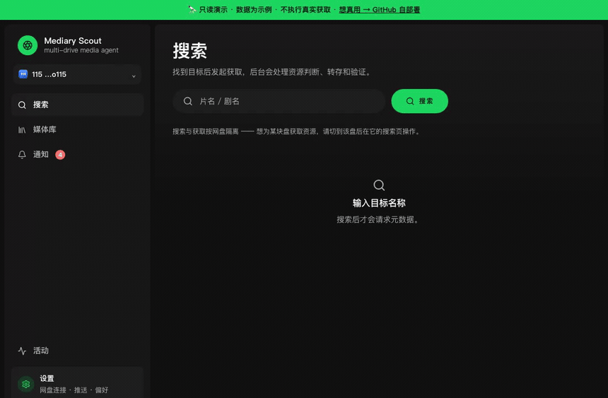
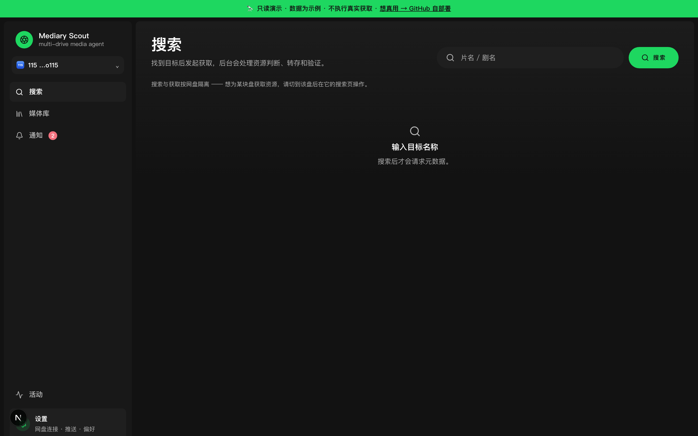
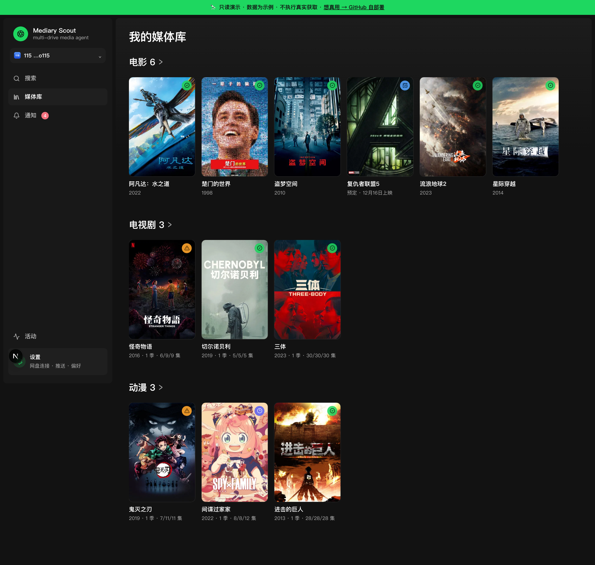
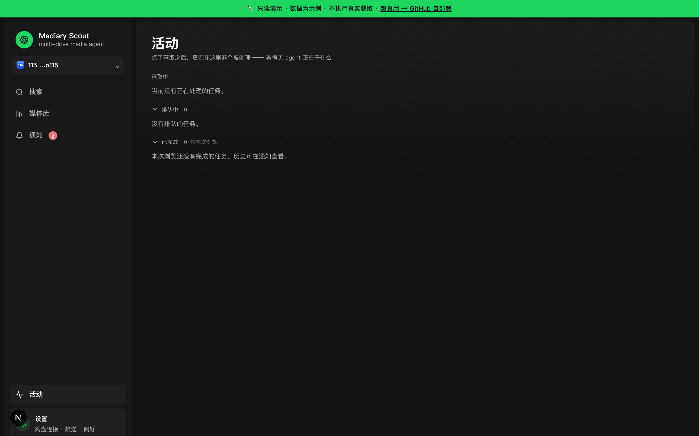
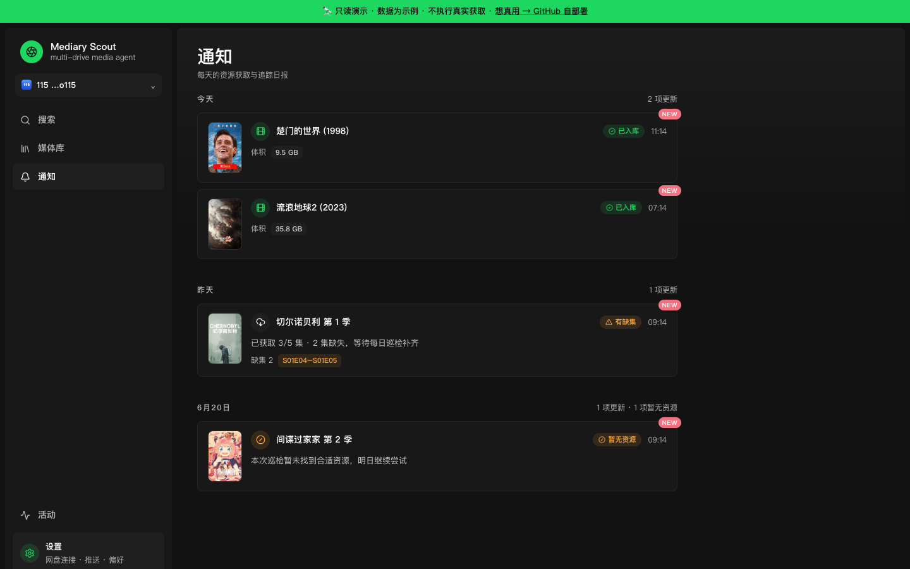
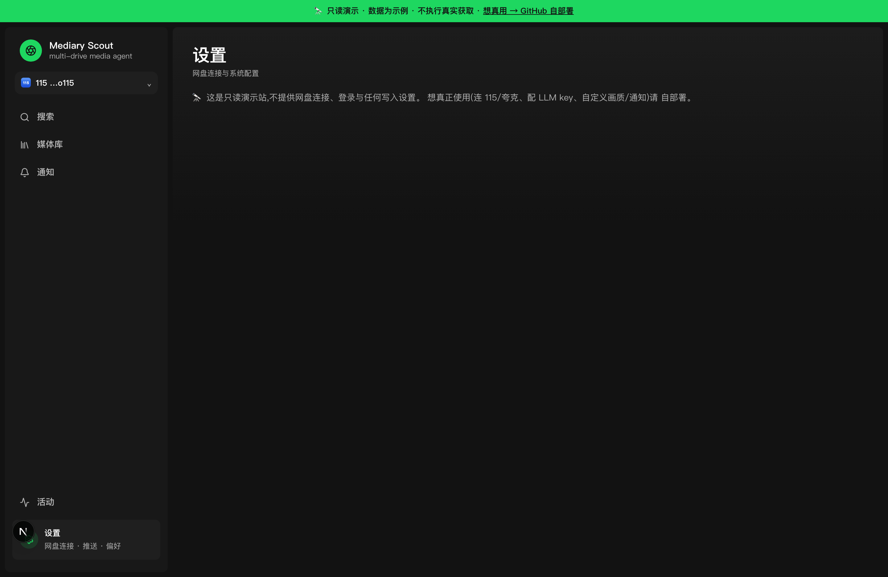
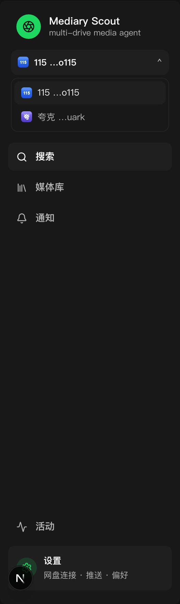
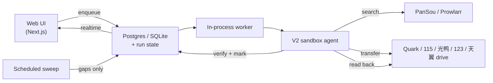

<p align="center">
  
</p>

<p align="center">
  <b>An agent-driven media library for your cloud drives.</b>
</p>

<p align="center">
  <a href="https://github.com/fancydirty/mediary-scout/actions/workflows/ci.yml"></a>
  <a href="https://github.com/fancydirty/mediary-scout/releases"></a>
  <a href="LICENSE"></a>
  <a href="https://github.com/fancydirty/mediary-scout/pulls"></a>
</p>

<p align="center">
  <a href="https://github.com/fancydirty/mediary-scout/releases/latest">📥 Download</a> ·
  <a href="https://mediaryscout.app">🌐 Website</a> ·
  <a href="https://demo.mediaryscout.app">🔭 Live Demo</a> ·
  <a href="README.zh-CN.md">中文文档</a>
</p>

---

You ask for a movie, show, or anime; an LLM agent scouts resources across your indexers, transfers the best match into your own 115 / Quark / 光鸭 drive, verifies what landed, and keeps tracking what's still missing.



> *Above: the read-only [live demo](https://demo.mediaryscout.app) — search → 获取 → the agent works through search, transfer, and verification.*

## Install

### Desktop app (recommended — easiest)

| Platform | Download | Notes |
|---|---|---|
| **macOS** (Apple Silicon) | [DMG → Releases](https://github.com/fancydirty/mediary-scout/releases/latest) | Signed + notarized, no Gatekeeper warning |
| **Windows** (x64) | [EXE installer → Releases](https://github.com/fancydirty/mediary-scout/releases/latest) | Unsigned — SmartScreen will prompt, click "run anyway" |

1. Download and install
2. Open the app
3. Go to **Settings** — connect a drive, add an LLM endpoint
4. Search a title, hit 获取 — that's it

No Docker, no Postgres, no terminal. The app bundles its own SQLite data layer and runs the full engine inside an Electron shell.

Every release is machine-verified before it ships: CI installs the freshly-built Windows package on a clean runner, boots the real app, and requires an HTTP 200 health response, while the macOS build must pass native-ABI verification, signing, and notarization. Both platforms are published together in a single final step — if either gate fails, neither asset is uploaded, so a broken build can't reach the Releases page.

### Docker (power users — always-on server)

```bash
cp .env.example .env   # optional — most config can be set in the UI
docker compose up -d
```

Then open `http://<host>:3000` and configure in **Settings**. Full walkthrough: **[docs/deploy.md](docs/deploy.md)**.

> 🇨🇳 **Can't reach Docker Hub (mainland China)?** See **[docs/deploy.md → registry mirror](docs/deploy.md#国内构建加速连不上-docker-hub)**.

### Which path?

| | Desktop App | Docker |
|---|---|---|
| **Best for** | Personal use, Mac/Windows | NAS, server, 24/7 monitoring |
| **Setup** | Download + open | `docker compose up -d` |
| **Database** | SQLite (default) | Postgres (default; SQLite via `MEDIA_TRACK_SQLITE_PATH`) |
| **Agent API** | ✅ | ✅ |
| **Always-on patrol** | ❌ (runs when app is open) | ✅ |
| **Multi-user** | ❌ | ✅ |
| **Remote access** | Local only | Tailscale / Cloudflare Tunnel |

Both paths share **one codebase** — all product logic is identical. The data layer (SQLite vs Postgres) is selected by the `MEDIA_TRACK_SQLITE_PATH` env var, not the process shell — desktop sets it automatically, Docker defaults to Postgres.

## Features

| | |
|---|---|
| **Search → acquire** — find a title, hit 获取, the agent takes over |  |
| **Library wall** — what you have, per drive, with missing / airing badges |  |
| **Show detail** — season coverage, gaps, tracking state |  |
| **Realtime activity** — a live queue + agent action ticker while it works |  |
| **Notifications** — per-acquisition + daily digest, multi-channel push |  |
| **Settings** — drives, quality, language, LLM (BYO-key), Prowlarr, PanSou |  |

Multiple drives appear as a workspace switcher with per-brand icons:



## What it is

Most "media automation" either searches well but doesn't know what you're actually missing, or moves files but never verifies what landed. Mediary Scout treats acquisition as a **state problem**, driven by an agent that acts from evidence, not vibes:

- **Multi-drive, brand-extensible** — five drives today (Quark, 115, 光鸭 GuangYaPan, 123, 天翼 Tianyi), each a first-class workspace (a tree model: one account, many drives). Adding a new drive brand is a contained plugin.
- **Agent-driven selection** — the agent reads real search results and picks by quality preference, **Chinese-subtitle** needs, and de-duplication, then verifies the transfer after it happens.
- **Tracking & scheduled gap-fill** — season-level state machine; a scheduled sweep comes back only for shows that still have missing episodes.
- **Cloud-native** — it **transfers** shares/magnets straight into your drive (秒传 / save), it does not download to a local disk.

## Supported drives

Five Chinese cloud drives, each a first-class workspace — ordered by how many PanSou resources each can consume:

- **Quark / 夸克** (`quark`) — share-link transfer (no magnet web API). The largest share pool on PanSou by far.
- **115** (`pan115`) — full support: 115 share links **and** magnets (built-in offline path, plus Prowlarr).
- **GuangYaPan / 光鸭云盘** (`guangya`) — Xunlei-family drive; **magnet / offline-download only** (transfers magnet/ed2k/BT via its offline-task API — it does **not** transfer share links in v1). Token auth. Pairs well with Prowlarr. **[Setup guide](docs/deploy.md#光鸭云盘guangyapan连接)**
- **123网盘** (`pan123`) — share-link transfer (`123pan.com/s/…`); QR login (~90-day token) or paste a token. Free accounts can transfer (server-side copy costs no download quota). **[Setup guide](docs/deploy.md#123网盘连接)**
- **Tianyi / 天翼云盘** (`tianyi`) — share-link transfer (`cloud.189.cn/t/…`); QR login or paste an SSON cookie. Smallest share pool on PanSou today (weak for movies, workable for shows/anime). **[Setup guide](docs/deploy.md#天翼云盘连接)**

Measured share volume per drive (2026-07 point-in-time sample: six popular titles across movie / drama / anime, one PanSou instance with curated channels — your channels will vary):

| Drive | Own share links | Magnets it can also eat | Usable pool |
| --- | ---: | ---: | ---: |
| Quark | 523 | — | **523** |
| 115 | 100 | 361 | **461** |
| 光鸭 | — | 361 | **361** |
| 123 | 120 | — | **120** |
| 天翼 | 63 | — | **63** |

New brands plug into a storage-brand registry; the bulk of adding one is a drive client + a storage executor for that drive's transfer API.

## Agent API (agent-first control)

Both the desktop app and the container expose a local HTTP API that lets any coding agent (Claude Code, Codex, opencode, …) operate Mediary Scout without opening the GUI — change settings, trigger acquisitions, check download progress.

**Desktop**: automatic — on first launch the app writes a discovery file to `~/.mediary/agent.json`. **Container**: set `MEDIA_TRACK_AGENT_TOKEN` env var to opt in.

Install the agent skill:

```bash
mkdir -p ~/.claude/skills/ && cp -r skills/mediary-scout ~/.claude/skills/      # or ~/.codex/skills/, ~/.config/opencode/skills/
```

Then tell your agent things like "帮我找进击的巨人第二季" or "蜘蛛侠下好了吗" or "把画质改成 high". See [`skills/mediary-scout/SKILL.md`](skills/mediary-scout/SKILL.md) for the full trigger list.

| Method | Path | Purpose |
|---|---|---|
| `GET` | `/api/agent/config` | Read settings (secrets masked) |
| `PUT` | `/api/agent/config` | Partial update (rejects masked `***` writes) |
| `POST` | `/api/agent/acquire` | Search TMDB → queue (409 on ambiguity) |
| `POST` | `/api/agent/patrol` | Trigger a patrol sweep |
| `GET` | `/api/agent/library` | Tracked titles + missing episodes |
| `GET` | `/api/agent/activity` | Active queue + recent notifications |

All require `Authorization: Bearer <token>`. No token configured → `404` (invisible). Wrong/missing token → `401`.

## Architecture

A web app enqueues work; a long-running worker drives a sandboxed agent that has narrow, audited powers while the deterministic workflow owns every side effect and re-reads real state to verify.



- State lives in **Postgres** (container) or **SQLite** (desktop) — runs are resumable across restarts (the agent rebuilds from real drive + DB state, not cached chat history).
- Metadata comes from **TMDB** (with a built-in proxy fallback so it works out of the box); resource search from **PanSou** and optionally **Prowlarr** (torrent/magnet indexers).

## Demo

**🔭 Try it live: [demo.mediaryscout.app](https://demo.mediaryscout.app)**

A public, **read-only** demo — mock drives, real TMDB search across the whole catalog, and a scripted acquisition you can watch land in the library. No drive connect, no transfers, nothing persists.

## Deploy (Docker)

Self-host on a NAS, a router (软路由), a spare PC, or a VPS — and reach it from your phone / TV via **Tailscale** or a **Cloudflare Tunnel** (no public IP needed; never expose `:3000` raw). Full walkthrough: **[docs/deploy.md](docs/deploy.md)**.

### Deploy with an agent

Prefer to have an AI agent walk you through it? Paste this prompt:

````markdown
You are deploying Mediary Scout, a self-hosted media-acquisition agent. Follow the repo's docs/deploy.md. Ask the user the questions below IN ORDER, then execute.

## MUST ask (don't start without answers)
1. **Where are you deploying?** Which machine (NAS / router / spare PC / VPS), and how do I operate it — SSH in, or run commands on its local terminal?
2. **Single-user or multi-user?** Default single-user (just you). Multi-user lets family/friends each register, bind their own drives, and keep separate libraries.

## SHOULD ask (have defaults, but confirm preference)
3. **Local-only, or reach it from outside?**
   - Local network only (default — open `http://<host>:3000` from devices on the same LAN)
   - Tailscale (private mesh — recommended for home; no public IP, auto-encrypted)
   - Cloudflare Tunnel (public HTTPS like `https://media.yourdomain.com` — needs a domain on Cloudflare + Access in front)
4. **Configure real acquisition now, or just get it running first?** Real acquisition needs a supported drive (Quark/115/光鸭/123/天翼) + an LLM endpoint (OpenAI-compatible) + (if using 115) 115 directory CIDs. Skipping means it boots and you can look around, configure later in Settings.

## OPTIONAL — one question, skip all if the user doesn't care
5. Any of these you want to set up now? Reply "none" to skip and use defaults:
   - Push notifications (Bark / Server酱 / WeChat Work / webhook)
   - Your own TMDB key (default: works out of the box via the author's proxy)
   - Prowlarr magnet aggregation (115 only)
   - Build acceleration (registry mirror + npm mirror — needed in mainland China)

## Then execute
- `git clone https://github.com/fancydirty/mediary-scout && cd mediary-scout`
- If build acceleration (mainland China): `docker compose build --build-arg NPM_REGISTRY=https://registry.npmmirror.com` + a registry mirror in `/etc/docker/daemon.json`, **before** the first `up`
- `docker compose up -d` (first build takes a few minutes)
- If multi-user: add `MEDIA_TRACK_MULTI_USER=1` to `.env`, then `docker compose up -d web`
- If Cloudflare Tunnel: follow docs/deploy.md §"方式二" — create the tunnel in the Zero Trust dashboard, put the token in `.env` as `TUNNEL_TOKEN=<your-token>`, `docker compose --profile tunnel up -d`, and **add Cloudflare Access** (never expose the instance without auth)
- Open `http://<host>:3000`, walk the user through Settings (drive / LLM / optional extras)
- Verify it's up, report the URL, and tell them how to upgrade (`git pull && docker compose up -d --build`)
````

> **Disclaimer.** Mediary Scout is **open-source, self-hosted software**. It is **not** offered, and never will be offered, as a hosted service — you run your own instance and bring your own drive / LLM / metadata credentials. It performs the same kinds of file operations you could do by hand in your own cloud drive. See [docs/distribution-and-legal-positioning.md](docs/distribution-and-legal-positioning.md) for the project's stance.

## Status & limitations

- Self-hosted, for advanced users; you need usable access to a supported drive (Quark/115/光鸭/123/天翼 — a membership is most practical on 115/夸克; 123/天翼 work on free accounts).
- Scheduled monitoring is most valuable on an always-on host (Docker path).
- This is not a hosted product and ships no hosted backend.

## Credits & upstream

Built on top of, and grateful to:

- [PanSou](https://github.com/fish2018/pansou-web) — resource search backend
- [Prowlarr](https://github.com/Prowlarr/Prowlarr) — indexer manager (optional)
- [p115client](https://github.com/ChenyangGao/p115client) — 115 API reference
- [AList](https://github.com/AlistGo/alist) — GuangYaPan (光鸭云盘) API integration reference (the `drivers/guangyapan` driver)
- [p123client](https://github.com/ChenyangGao/p123client) — 123网盘 API reference
- [cloud189-auto-save](https://github.com/1307super/cloud189-auto-save) / [cloudpan189-api](https://github.com/tickstep/cloudpan189-api) — 天翼云盘 API references
- [TMDB](https://www.themoviedb.org/) — metadata (this product is not endorsed or certified by TMDB)

Not affiliated with 115, Quark, 光鸭云盘 (GuangYaPan), 123网盘, 天翼云盘, TMDB, or any indexer. Mediary Scout is an independent, disciplined workflow built around these pieces.

## Star History

